# KNN on Lower Back Pain Symptoms Dataset

**Author**: SHAILESH DHAMA

### Business problem:

To identify a person is affected or normal using collected physical spine details/data.

### SYMPTOMS:

Lower back pain can be caused by a variety of problems with any parts of the complex, interconnected network of spinal muscles, nerves, bones, discs or tendons in the lumbar spine.

Typical sources of low back pain include:

    * The large nerve roots in the low back that go to the legs may be irritated
    * The smaller nerves that supply the low back may be irritated
    * The large paired lower back muscles (erector spinae) may be strained
    * The bones, ligaments or joints may be damaged
    * An intervertebral disc may be degenerating

An irritation or problem with any of these structures can cause lower back pain and/or pain that radiates or is referred to other parts of the body. Many lower back problems also cause back muscle spasms, which don't sound like much but can cause severe pain and disability.
While lower back pain is extremely common, the symptoms and severity of lower back pain vary greatly. A simple lower back muscle strain might be excruciating enough to necessitate an emergency room visit, while a degenerating disc might cause only mild, intermittent discomfort.

### Dataset :
This data set contains 310 Observations, 13 Attributes (12 Numeric Predictors, 1 Binary Class Attribute - No Demographics)

### REQUIRED LIBRARIES:
    1.Numpy
    2.Pandas
    3.Matplotlib
    4.Seaborn
    5.Sklearn
    6.xgboost

## STEPS:

    - Visualize the number of abnormal and normal cases
    - Custom correlogram
    - Histogram of Each Features
    - Detecting and Removing Outliers
    - Detect and Remove Outliers by hand
    - Feature Scaling
    - Label Encoding
    - Marginal plot
    - KNN Modelling

## RESULTS :-

#### Visualisation Of Normal and Abnormal Cases:
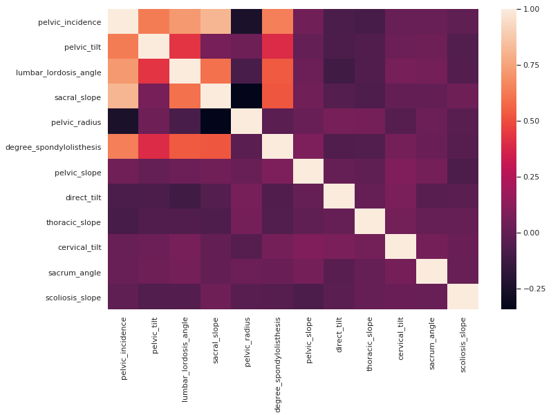
> Correlation between features.

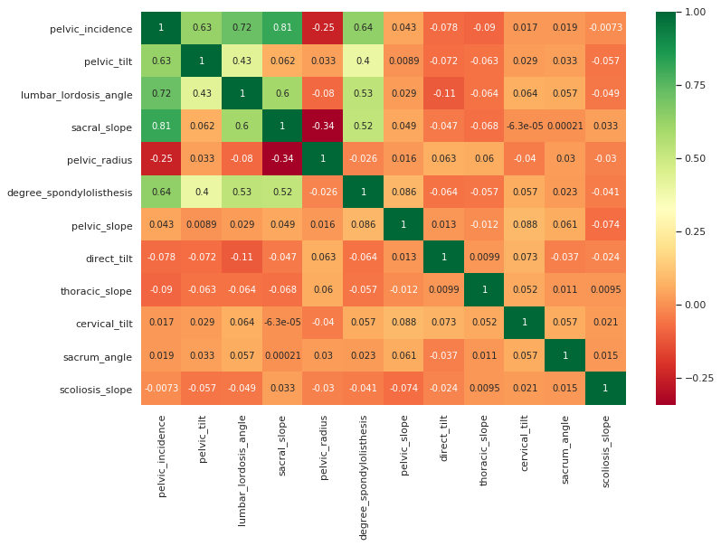
> Correlation between features.

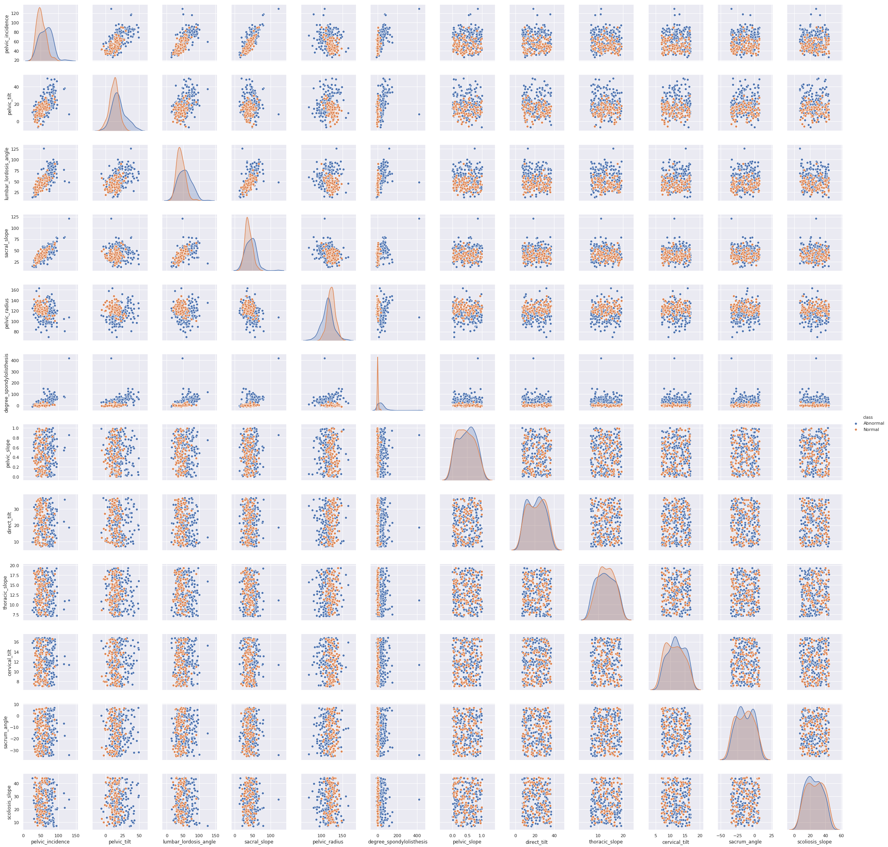
> Custom correlogram.

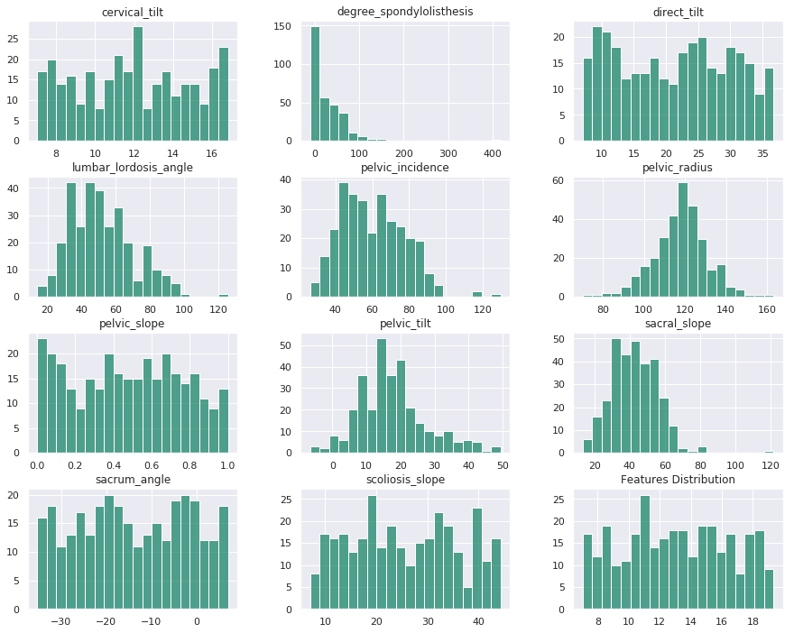
> Histogram of Each Features.

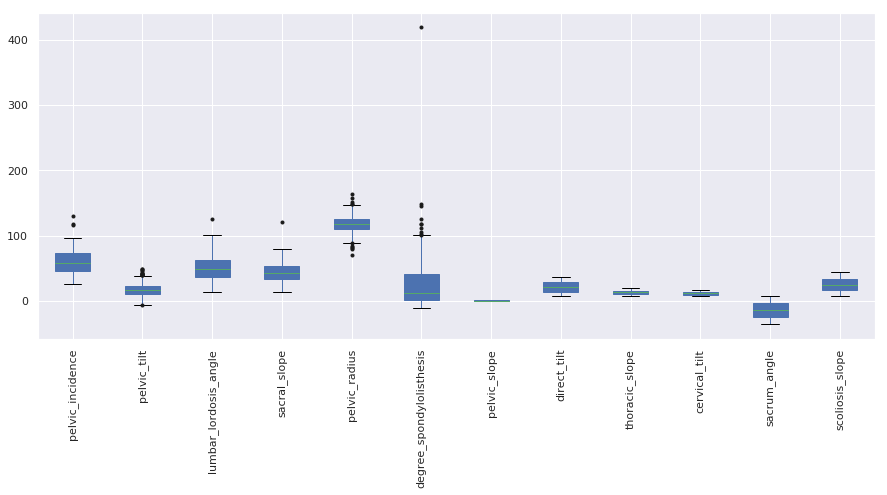
> Detecting and Removing Outliers.

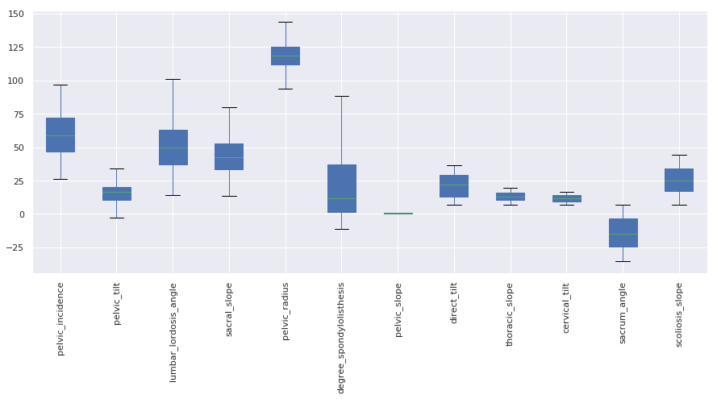
> Detect and Remove Outliers by hand.

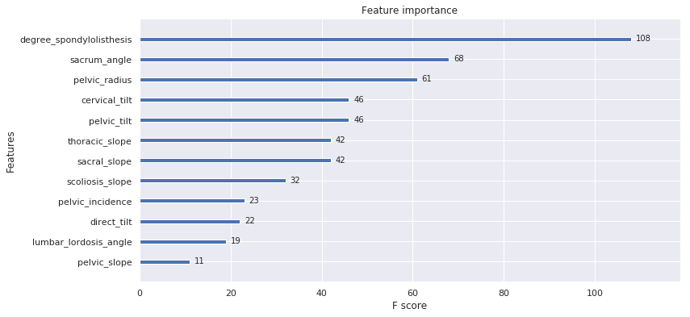
> Label Encoding.

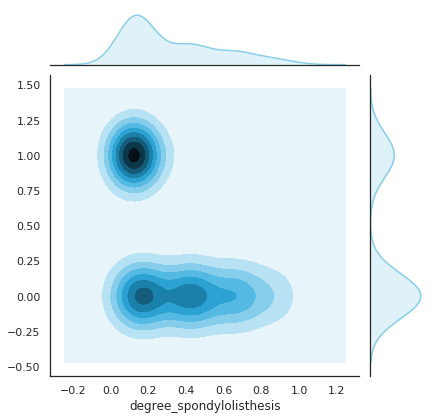
> Marginal plot.

#### KNN Modelling:
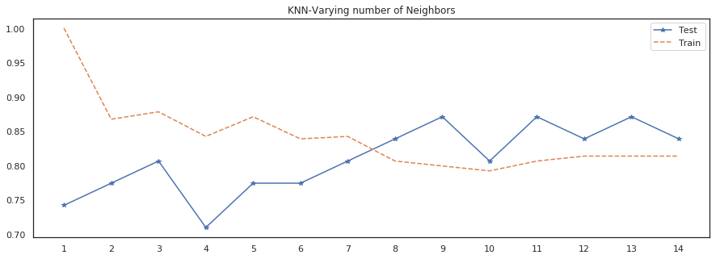

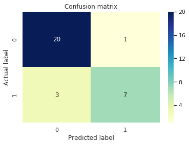
> Confusion Matrix.

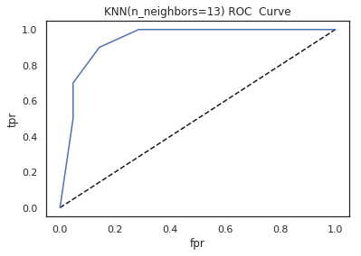
> ROC Curve.

### For further information
Please review the narrative of our analysis in [our jupyter notebook](./knn-on-lower-back-pain-symptoms.ipynb)

For any additional questions, please contact **shaileshshettyd@gmail.com)

##### Repository Structure:

```
├── README.md                                         <- The top-level README for reviewers of this project.
├── knn-on-lower-back-pain-symptoms.ipynb             <- narrative documentation of analysis in jupyter notebook
└── images                                            <- both sourced externally and generated from code
```
